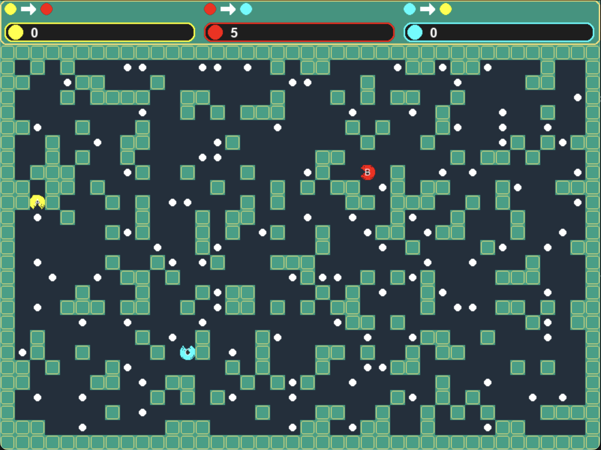

# Python Final Project



## Environment setup
Environment setup:
```
conda env create -f env.yml
conda activate python-final
```

## Run the game
```
python main.py
```

## Pacman movement
Remember to switch the keyboard to English
- A: w, s, a, d
- B: up, down, left, right
- C: i, k, j, l


        